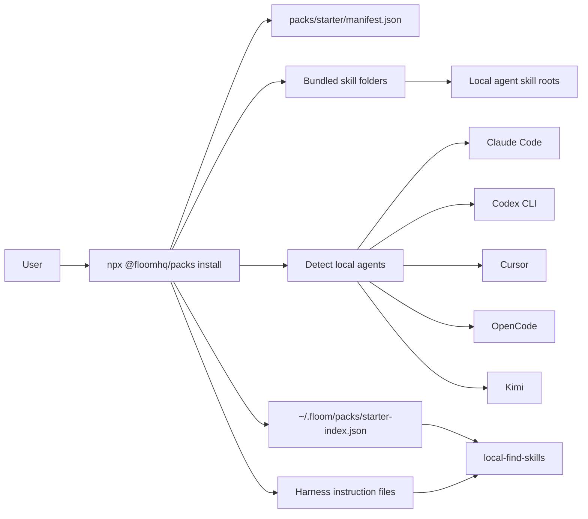
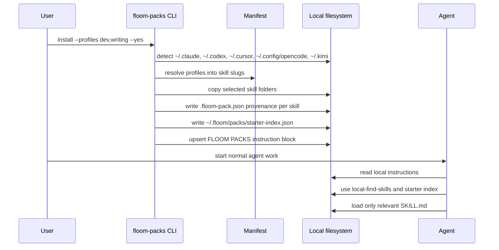
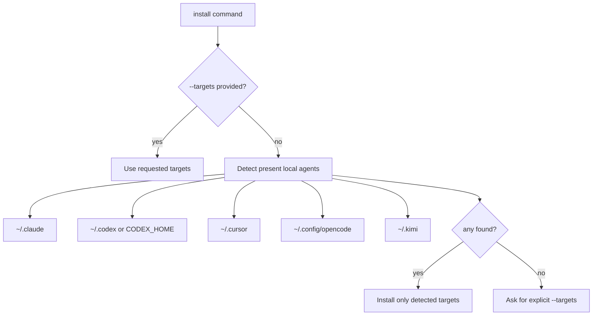
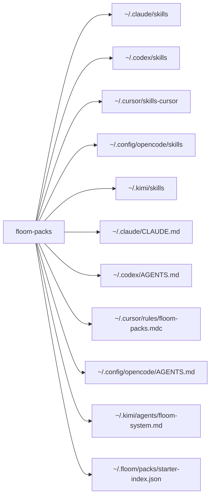
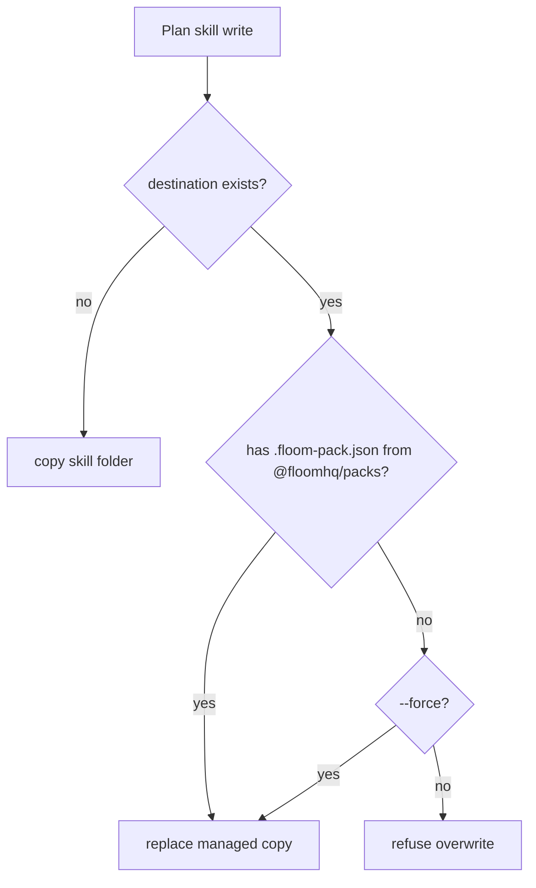
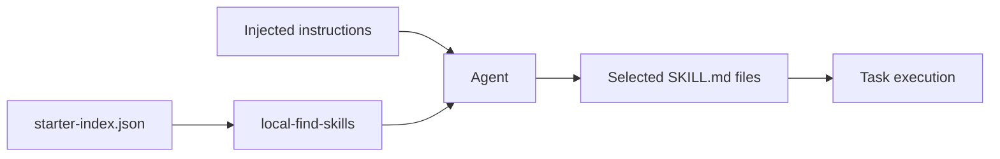
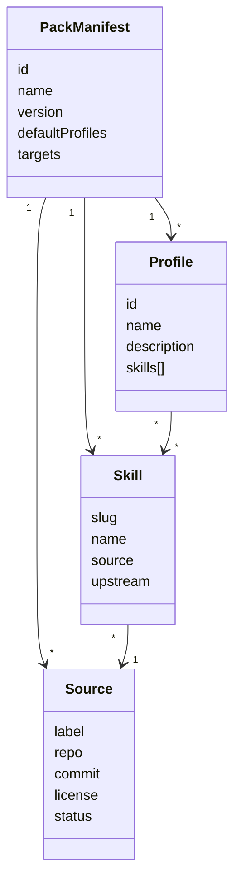
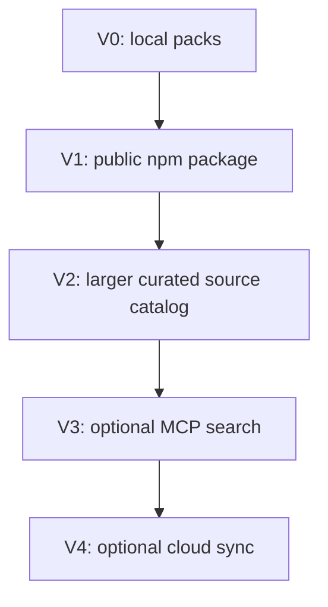

# Floom Packs Architecture

Floom Packs is a local-first installer for curated agent skills. It is separate
from the Floom cloud product.

Current package:

- npm package name: `@floomhq/packs`
- CLI binary: `floom-packs`
- default pack: `starter`
- repo: `floomhq/packs`

## Product Boundary

Floom Packs V0 installs local skills and local discovery instructions. It does
not require a Floom account, Floom cloud, daemon sync, or MCP.



## Mental Model

```text
curated source skills
        |
        v
pack manifest
        |
        v
floom-packs installer
        |
        +--> local skill folders
        +--> local starter index
        +--> local-find-skills
        +--> instruction snippets
```

The local skill folders remain the runtime surface because Claude Code, Codex,
Cursor, OpenCode, and Kimi can read local files today.

The index and injected instructions solve discoverability without loading every
skill into model context.

## Runtime Flow



## Install Target Detection

When `--targets` is omitted, the CLI detects installed agents by checking for
their home/config directories.



Explicit target choices:

- `--targets claude,codex`
- `--targets cursor`
- `--targets all`

## File Writes

For each selected target, the installer writes selected skill folders and one
instruction file.



## Conflict Model

The installer writes a `.floom-pack.json` provenance file into every installed
skill folder.



This protects user-created local skills from silent replacement.

## Discovery Model

V0 discovery is local. There is no MCP requirement.



The injected instruction block tells agents:

- use local starter skills when relevant;
- search the local index first;
- prefer `local-find-skills` for discovery;
- load only relevant `SKILL.md` files;
- avoid preloading every installed skill.

## Data Model

The pack manifest is the source of truth for profiles, skill membership, source
provenance, and launch targets.



## Current Source Policy

Bundled now:

- Floom-authored utility skills.
- Selected SkillsBench-derived skills from Apache-2.0 upstream.

Planned curation sources:

- skills.sh ecosystem.
- Native Claude skills and examples.
- gstack, after standalone-safe extraction.
- superpowers, after license/provenance review.
- Other high-signal open skill collections after license review.

Third-party sources are only bundled after provenance and license status are
recorded in the manifest.

## V0 vs Later



V0:

- local npm installer;
- profile selection;
- local skill folders;
- local index;
- local instructions;
- no login.

Later:

- richer curated sources;
- optional MCP search for larger libraries;
- optional cloud sync after the main Floom backend is stable.

## Verified Behaviors

Current tests verify:

- manifest references existing skill folders;
- every bundled skill has frontmatter and description;
- dry-run writes nothing;
- temp-root install writes skills, index, provenance, and instructions;
- target autodetection works;
- missing detected targets produces an explicit error;
- `--targets all` writes all five launch targets;
- untracked existing skills are not overwritten.

