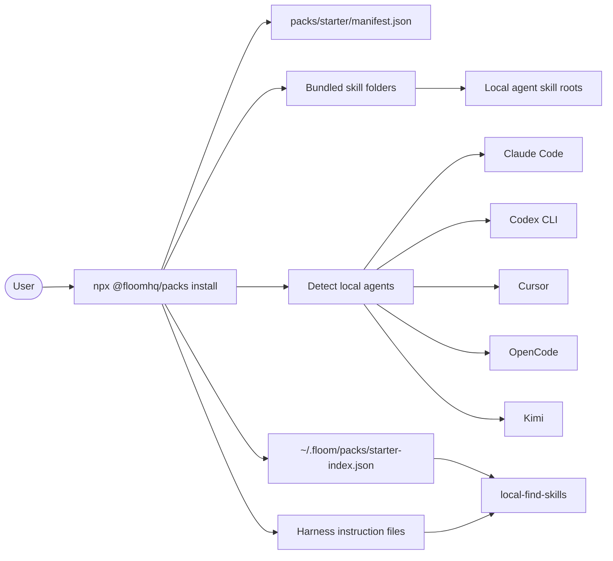
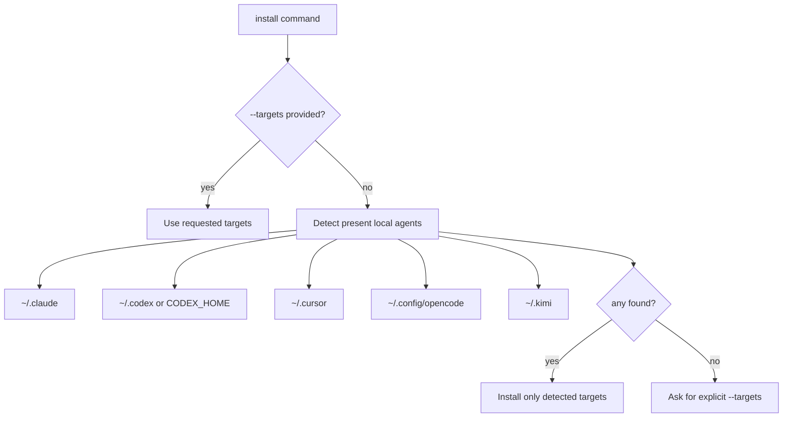
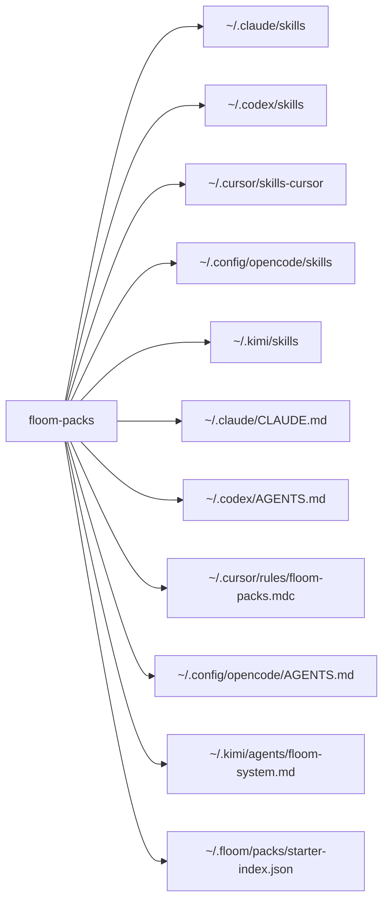
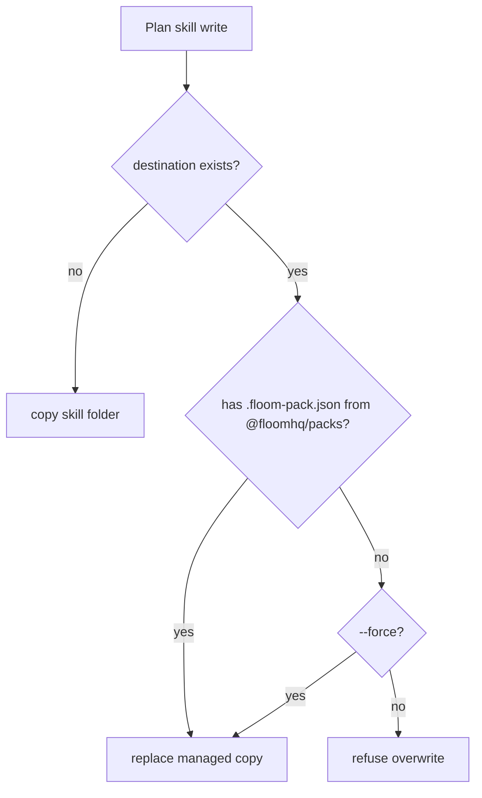
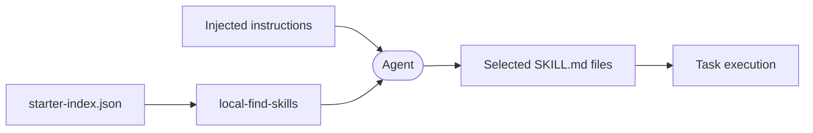
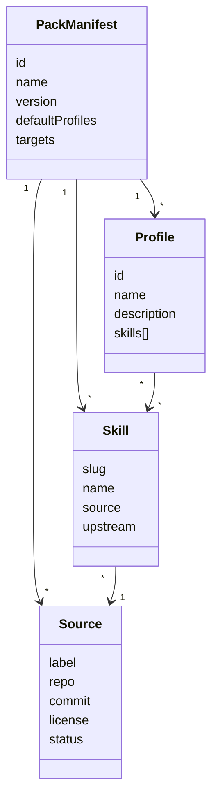

# Floom Packs

[](https://www.npmjs.com/package/@floomhq/packs)
[](./licenses)
[](./docs)

**Curated skills, installed locally.**

Floom Packs is a standalone npm installer for local agent skills. It is intentionally simpler than Floom cloud: no account, no daemon, no MCP requirement, and no remote sync. One command gives your agent a curated starter bundle of 29 skills across 11 profiles.

```bash
npx @floomhq/packs install
```

---

## Table of Contents

1. [Quick Start](#quick-start)
2. [Mental Model](#mental-model)
3. [Install Flow](#install-flow)
4. [Files Written](#files-written)
5. [Conflict Protection](#conflict-protection)
6. [Skill Discovery](#skill-discovery)
7. [Data Model](#data-model)
8. [Profiles](#profiles)
9. [Targets](#targets)
10. [Next Curation Pass](#next-curation-pass)
11. [Verified Behaviors](#verified-behaviors)
12. [Contributing](#contributing)
13. [License](#license)

---

## Quick Start

Preview what will be installed (dry-run, writes nothing):

```bash
npx @floomhq/packs install --dry-run
```

Install selected profiles to detected local agents:

```bash
npx @floomhq/packs install --profiles core,dev,writing --yes
```

Install specific profiles to specific targets:

```bash
npx @floomhq/packs install --profiles core,dev,writing --targets claude,codex --yes
```

Install all profiles to all targets:

```bash
npx @floomhq/packs install --all --yes
```

Test against a temporary root (writes nothing to your real agent dirs):

```bash
npx @floomhq/packs install --profiles core,dev --targets claude,codex --root /tmp/floom-packs-test --yes
```

List available profiles and skills:

```bash
npx @floomhq/packs list
```

---

## Mental Model

The package contains a manifest plus bundled skill folders. The installer resolves selected profiles, detects local agents, writes skills into their native roots, writes a local index, and adds instructions that teach agents to search locally.



V0 is local compatibility infrastructure. It proves the user value of curated skills without waiting for cloud sync, account setup, or MCP adoption.

---

## Install Flow

When the user runs install, explicit targets win. If no target is passed, the CLI detects local agent config directories and installs only to those agents.



---

## Files Written

Each target receives skill folders in its native root, a harness instruction file, and a shared local index.



---

## Conflict Protection

Every installed skill gets a provenance file (`.floom-pack.json`). Managed pack skills can be replaced by later installs. Untracked user-created folders are protected by default and will never be overwritten without `--force`.



---

## Skill Discovery

No MCP is required in V0. The discovery loop is local: injected instructions point the agent at the starter index and the `local-find-skills` skill.



MCP can come later for larger libraries and better search tools. It is not a launch dependency for Floom Packs V0.

---

## Data Model

The manifest links profiles to skills, and skills to their upstream source records — keeping provenance legible and auditable.



---

## Profiles

Run `npx @floomhq/packs list` to see available profiles and their skill counts.

V0 profiles:

| Profile | Description |
|---------|-------------|
| `core` | Foundational skills for all agent users |
| `dev` | Software development and engineering workflows |
| `writing` | Content, copy, and long-form writing |
| `research` | Research, synthesis, and source evaluation |
| `marketing` | Growth, campaigns, and messaging |
| `sales` | Prospecting, outreach, and pipeline |
| `ops` | Operations, process, and coordination |
| `founder` | Strategy, fundraising, and decision-making |
| `data` | Data analysis and reporting |
| `design` | UX, visual, and product design |
| `video` | Video production and post-production |

---

## Targets

Supported targets:

| Target | Config dir | Skill root | Instruction file |
|--------|-----------|------------|-----------------|
| `claude` | `~/.claude` | `~/.claude/skills` | `~/.claude/CLAUDE.md` |
| `codex` | `~/.codex` or `$CODEX_HOME` | `~/.codex/skills` | `~/.codex/AGENTS.md` |
| `cursor` | `~/.cursor` | `~/.cursor/skills-cursor` | `~/.cursor/rules/floom-packs.mdc` |
| `opencode` | `~/.config/opencode` | `~/.config/opencode/skills` | `~/.config/opencode/AGENTS.md` |
| `kimi` | `~/.kimi` | `~/.kimi/skills` | `~/.kimi/agents/floom-system.md` |
| `all` | — | All five above | All five above |

---

## Next Curation Pass

The current bundle is intentionally license-clean. The next pass focuses on higher-signal external ecosystems, with license and provenance recorded before bundling.

| Source | Goal | Gate |
|--------|------|------|
| skills.sh | Broad public skill ecosystem | License and attribution verification |
| Native Claude skills | High-quality agent-native patterns | Redistribution rights and adaptation policy |
| gstack | Strong developer workflow ideas | Standalone extraction without telemetry/update coupling |
| superpowers | Potential broad workflow skills | License/provenance review |
| Other open sources | Fill profile gaps | Clear source URL, commit, license, and quality score |

Output format for a curation agent: ranked table with source, path, commit, license, profile, score, risks, and next action.

See [docs/CURATION-BRIEF.md](./docs/CURATION-BRIEF.md) for the full brief.

---

## Safety

Real installs require `--yes`. Without `--yes`, `install` prints a dry-run plan.

Use `--root <dir>` to test against temporary roots:

```bash
npx @floomhq/packs install --profiles core,dev --targets claude,codex --root /tmp/floom-packs-test --yes
```

---

## Source Boundaries

Bundled sources:

- Floom-authored skills.
- Selected Apache-2.0 SkillsBench-derived skills.

Planned but not bundled yet:

- skills.sh ecosystem skills.
- superpowers skills.
- standalone-safe gstack skills.

These require license/provenance review before bundling.

---

## Verified Behaviors

Behaviors confirmed across all five launch targets:

- Manifest references existing skill folders.
- Every bundled skill has frontmatter and description.
- Dry-run writes nothing.
- Temp-root install writes skills, index, provenance, and instructions.
- Target autodetection works.
- Missing detected targets produces a clear error.
- `--targets all` writes all five launch targets.
- Untracked existing skills are not overwritten.

---

## Architecture

See [ARCHITECTURE.md](./ARCHITECTURE.md) for the full local install model, target detection, conflict handling, and discovery flow — with all mermaid diagrams.

---

## Contributing

1. Fork the repo and create a branch from `main`.
2. For new skills: add a folder under `packs/starter/skills/<slug>/` with a `SKILL.md` and a `.floom-pack.json` provenance file.
3. For new profiles: add an entry to `packs/starter/manifest.json` and document it in this README.
4. Run `npm test` before submitting a PR.
5. Open a PR — do not merge without review.

For curation contributions (proposing external skills), open an issue with: source URL, commit/version, license, target profile, and a one-line quality justification.

---

## License

Apache-2.0. See [licenses/](./licenses) and [NOTICE.md](./NOTICE.md) for third-party attributions.
