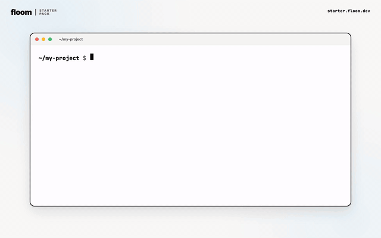

<div align="center">

# Floom Starter Pack

**65 hand-picked AI agent skills. One install. Auto-activates.**

Works with Claude Code, Codex, Cursor, Kimi, OpenCode.



[](https://www.npmjs.com/package/@floomhq/starter)
[](https://www.npmjs.com/package/@floomhq/starter)
[](https://opensource.org/licenses/MIT)
[](https://github.com/floomhq/starter)

[Install](#install) · [What you get](#what-you-get) · [How it works](#how-it-works) · [Docs](https://floom.dev/docs) · [Browse skills](https://floom.dev/library)

</div>

---

## Install

```bash
npx @floomhq/starter install --global
```

That installs all 65 curated skills machine-wide into all eligible agents on your computer. Omit `--global` for a project-local install in the current repository, or pass `--profiles dev,writing` for a smaller subset. Auto-detects Claude Code, Codex, Cursor, Kimi, or OpenCode.

## What you get

65 skills across 11 profiles:

| Profile | Skills | Examples |
|---------|--------|----------|
| Core | 9 | find-skills, skill-creator, brainstorming, grill-me, systematic-debugging, writing-plans |
| Dev | 12 | next-best-practices, supabase-postgres-best-practices, tdd, webapp-testing, frontend-design |
| Writing | 9 | copywriting, copy-editing, content-strategy, brand-guidelines, doc-coauthoring |
| Research | 8 | just-scrape, agent-browser, pdf, xlsx, zoom-out |
| Marketing | 12 | seo-audit, marketing-psychology, social-content, programmatic-seo, page-cro, analytics-tracking |
| Sales | 8 | cold-email, sales-enablement, revops, churn-prevention, pricing-strategy |
| Ops | 10 | workplan, to-issues, to-prd, triage, internal-comms |
| Founder | 10 | pricing-strategy, product-marketing-context, launch-strategy, brand-guidelines |
| Data | 9 | xlsx, pdf, just-scrape, fuzzy-match, python-parallelization, testing-python |
| Design | 9 | frontend-design, web-design-guidelines, audit, polish, critique, tailwind-design-system |
| Video | 6 | video-polish, remotion-best-practices, audio-extractor, video-processor |

[Browse the full library](https://floom.dev/library)

## How it works

1. One npm command runs the installer.
2. Auto-detect your AI agent (Claude Code, Codex, Cursor, Kimi, OpenCode).
3. Skills install locally to your machine (`~/.claude/skills/`, `~/.codex/skills/`, etc.) or to the current project when you omit `--global`.
4. Folder-based skills also receive upstream support files when available, such as references and scripts.
5. Activation rules are added to your agent's config so the right skill fires on the right task.
6. You update manually with `npx @floomhq/starter update`. The package has no daemon, no cron, and no background network process.

## Why curated

skills.sh has 91,000+ AI agent skills. Most agents drown in choice or pick wrong. We picked 65 high-signal skills with real usage, clear licenses, broad applicability, and low setup friction. We filtered out narrow cloud-vendor skills, API-key-heavy skills, duplicate prompts, and personal dotfile snippets that do not belong in a general starter pack.

**+16.2pp average pass-rate lift** on SkillsBench when agents use curated skills. **-2.9pp** for a kitchen-sink public-index install. Curation matters.

## Updating

```bash
npx @floomhq/starter update
```

Pulls the latest install counts and any updated SKILL.md content. Skills you customized are preserved.

## Listing what is installed

```bash
npx @floomhq/starter list
```

## Uninstalling

```bash
npx @floomhq/starter uninstall
```

Removes the skill directories and the activation block from your agent's config. Your other skills are not touched.

## Architecture

```
floomhq/starter (this repo)
├── manifest.json           slim index (65 skills + 11 profiles)
├── skills/<slug>.json      full per-skill data (SKILL.md content, files, source)
└── cli/
    └── @floomhq/starter (npm)  the CLI users install
```

The CLI fetches the slim manifest at install time, then lazy-loads per-skill JSONs only for skills the user installs. `npx @floomhq/starter update` refreshes manually while preserving user-edited files by default.

## Privacy

No telemetry. No account required. No daemon running. The CLI runs once, writes files locally, exits. Source code is open and auditable.

## License

MIT, copyright Floom contributors.

Individual skills retain their own licenses. See [licenses/README.md](licenses/README.md) for the per-source license table.

## Contributors

- [Federico de Ponte](https://x.com/fede_vault)
- Adam Beaudoin

Pull requests welcome.

## Links

- Site: [floom.dev](https://floom.dev)
- npm: [@floomhq/starter](https://www.npmjs.com/package/@floomhq/starter)
- Library: [Browse all 65 skills](https://floom.dev/library)
- Docs: [floom.dev/docs](https://floom.dev/docs)
- X: [@floomhq](https://x.com/floomhq)
